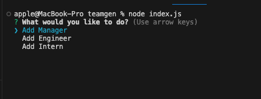
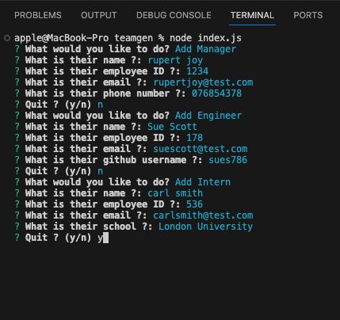
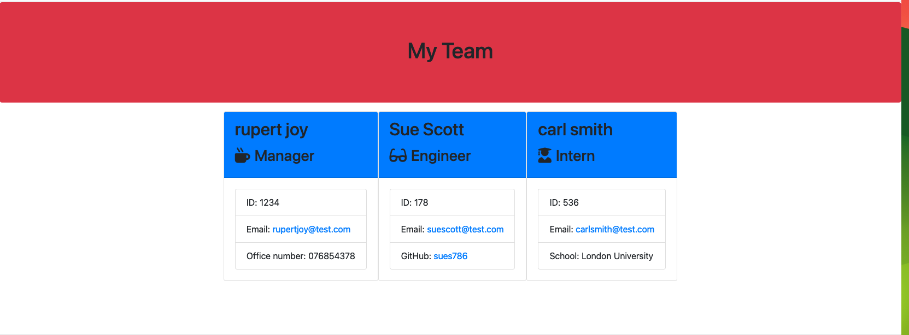
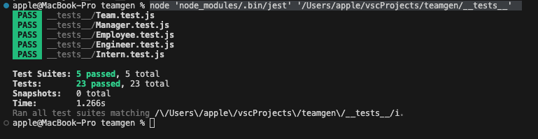

# Team Page Generator

## Background

We are to develop a console node application using inquirer to take input from the user and generate a html page which displays the members of a team.

## User Story

```text
AS A manager
I WANT to generate a webpage that displays my team's basic info
SO THAT I have quick access to their emails and GitHub profiles
```

## Acceptance Criteria


    Create a command-line application that accepts user input using the provided starter code.
    Create classes for each team member provided and export them. The tests for these classes, which are located in the _tests_ directory, must ALL pass.
    The first class is an Employee parent class with the following properties and methods:
        name
        id
        email
        getName()
        getId()
        getEmail()
        getRole()—returns 'Employee'

    The other three classes will extend Employee.

    In addition to Employee's properties and methods, Manager will also have the following:
        officeNumber
        getRole()—overridden to return 'Manager'

    In addition to Employee's properties and methods, Engineer will also have the following:
        github—GitHub username
        getGithub()
        getRole()—overridden to return 'Engineer'

    In addition to Employee's properties and methods, Intern will also have the following:

        school
        getSchool()
        getRole()—overridden to return 'Intern'

    Finally, although it’s not a requirement, consider adding validation to ensure that user input is in the proper format.
    Write code in index.js that uses Inquirer to gather information about the development team members and creates objects for each team member using the correct classes as blueprints.
    When a user starts the application, they're prompted to enter the team manager's:

        Name
        Employee ID
        Email address
        Office number

    When a user enters those requirements, the user is presented with a menu with the option to:

        Add an engineer
        Add an intern
        Finish building the team

    When a user selects the engineer option, the user is prompted to enter the following and then taken back to the menu:

        Engineer's Name
        ID
        Email
        GitHub username

    When a user selects the intern option, the user is prompted to enter the following and then taken back to the menu:

        Intern’s name
        ID
        Email
        School

    When a user decides to finish building their team, they exit the application and the HTML is generated.
 

    Write it to a file named team.html in the output folder.

    You can use the provided variable outputPath to target this location.


## Table of Contents

*[Description](#description)

*[Installation](#installation)

*[Usage](#Usage)

*[License](#license)

*[Contributing](#contributing)

*[Tests](#installation)

*[Questions](#questions)

## Description

 This application will generate a HTML file which can be to view the members of a team.

 To run the application, run the following command:

 ```
 node index.js
 ```

 The following screenshot shows what the user is prompted with:

 

 The options are to add an engineer, or intern or manager after selection and entering details you wil be prompted whether to quit (y/n). 
 If n then the menu to add appears again otherwise the team.html file is generated and saved in the root of the project. The application also echoes the 
 html to the console.

 The following screenshot shows entering the details of the team:
 

 The html output for the above entries is :

  


## Installation

To install necessary dependencies, run the following command:

```
npm i
```

## Usage

nothing

## License

This project is licensed under the MIT licence.

## Contributing

nothing

## Tests

To run the test suite use:

```
node 'node_modules/.bin/jest' '/Users/apple/vscProjects/teamgen/__tests__'

```

output after running command :



## Questions 

My github profile link:  https://github.com/pine-box

Any questions or feedback please contact me at : test@test.com


    
